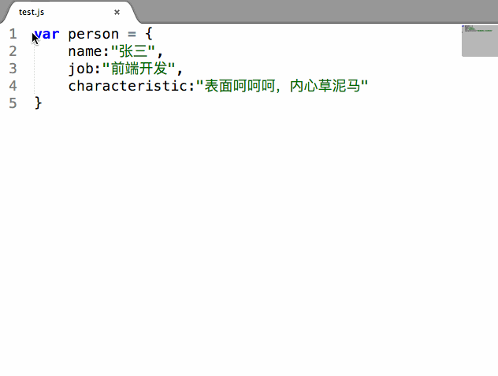
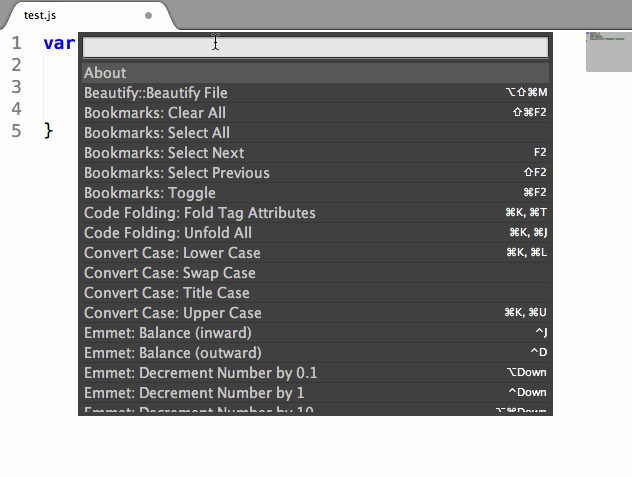

# ConvertChineseCharacters

Plugin for Sublime text for convert chinese characters, allowing you to convert your .js, .json, and .css files.

## Features

* Chinese Characters To Unicode
* Unicode to Chinese Characters

## Install

* Use <a href="https://packagecontrol.io/installation">Package Control</a>: search `ConvertChineseCharacters` and install
* Clone the source code into your sublime text's package folder

## Usage

Select one or more characters and run "convertChineseCharacters" form the context menu. Each character will be replaced.

# License

MIT

