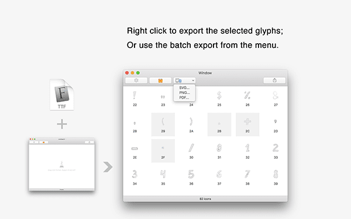

# FontMagic

FontMagic is a font manipulation application that supports macOS. It can export specific glyphs to SVG, PDF and PNG files. The color and size of the output can be set in the preferences.

Keyboard shortcuts:

* `Command + click` : to select multiple non-adjacent items;
* `Shift + click` : to select adjacent items.
* Double-click the font file (woff, woff2, ttf) in the Finder will open in FontMagic by default, you can also select FontMagic in the right-click menu opening method
* You can preview the selected icon through the **spacebar** shortcut like Finder

Right click to export the selected glyphs; or use the batch export from the menu.

## Dwonload 
* <a href="https://apps.apple.com/app/id1181350496">App Store</a>

## Comments
* <a href="https://github.com/leibnizli/FontMagic/issues">Issues</a>
