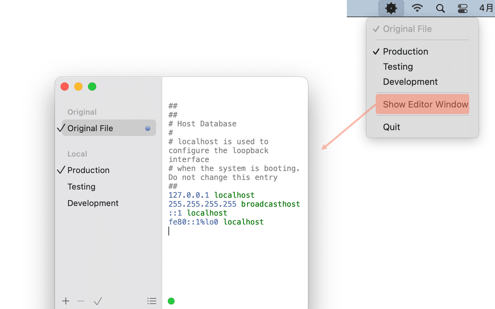

import ReactPlayer from 'react-player';

# Helm

Helm is a `hosts` file manager that runs on macOS. Helm enables you to edit `hosts` files and switch between them. Helm merges the original file and the active file into one file each time you switch. Write to the `hosts` file of the mac system.

You can set whether to transparent the title bar in the preferences (`⌘,`), and you can set whether to keep the menu bar running in the preferences (Keep running in menu bar when closing editor window). Assuming you choose to keep the menu bar running, Helm will not exit the program after closing the editing window, but will run in the form of the Menu Bar. You can quickly switch files in different environments through the Menu Bar.

Helm develops in swift.

## Install

* Download from Mac <a href="https://apps.apple.com/app/id1099472017">App Store</a>.

## Help

After starting, you can add different environmental files. When the first saves, the software will pop up the dialog box. Click the **Authorize** to obtain the `hosts` read and write permissions.

Then save the dialog box for the second time. At this time, you need to add writing permissions to the current MAC users. Copy the command line to the terminal (Bash, Iterm) to run the `enter` key to run, and enter the password to complete the authorization.

At this time, the 2 -step authorization operation has been completed and can be freely edited and combined with the hosts file, and there is no need to authorize anymore.

### Chrome does not take effect after modifying hosts

Perform the save operation in Helm, and Helm will automatically clear the dns cache. If the hosts do not take effect at this time, there are several ways to solve it:

* `command+shift+N`: Start incognito session in a new window in Chrome.
* Open `chrome://net-internals/#sockets` in chrome and click `Flush socket pools`.

### Skill

You can also quickly preview the modified hosts effect. Just press the shortcut key on the editing window: `Command + Shift + O`, and you can see the modified hosts file.

* `Command + shift + O`: Open System Host File
* `Command + D`: Duplicate
* `Command + /`: Toggle Comment
* `Command + +` : Make Text Bigger
* `Command + 0` : Make Text Normal Size
* `Command + -` : Make Text Smaller

### Video tutorial

<ReactPlayer controls url='https://user-images.githubusercontent.com/1193966/169488957-0c88d5f0-a9e0-4a2c-94c6-8c2f99481b5e.mov' />

## Comments
* <a href="https://github.com/leibnizli/Helm/issues">Issues</a>
