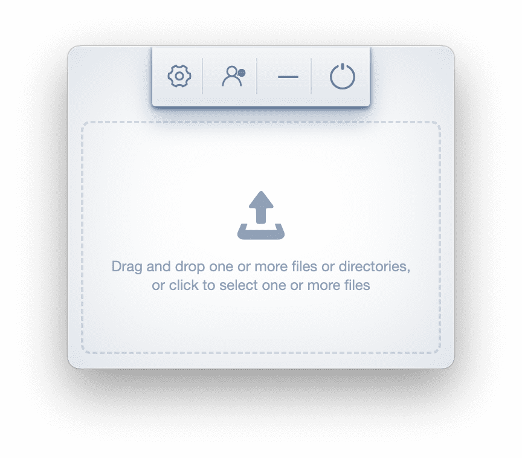

`Hummingbird` uses smart lossy compression techniques to reduce the file size of your files(jpg/png/webp/svg/gif/css/js/html).

* jpg/png/webp/svg/gif/html will replace the current file after compression, and a new file with .min will be generated after css/js compression
* You can create a `source` folder in the current directory and back up the files before processing, which can be enabled in the settings
* Supports clicking to select multiple files, but does not support clicking to select a folder. If you need to compress multiple folders, you can only drag and drop them.

## Install

### International network (国际网)

* <a href="https://github.com/leibnizli/hummingbird/releases">**macOS v4.2.0**</a> (Supports drag and drop folder compression and multi-threading)
* <a href="https://github.com/leibnizli/hummingbird/releases">**Windows v4.2.0**</a> (Supports drag and drop folder compression and multi-threading)

### Continental users（大陆网）

* <a href="https://pan.baidu.com/s/1_i0fzJ916mGe6Kn-zLERsQ?pwd=z79c">**macOS v4.2.0**</a> (支持拖放文件夹压缩，支持多线程)
* <a href="https://pan.baidu.com/s/1beSjp7IL5J0aOC70rFY5ng?pwd=a9a8">**Windows v4.2.0**</a> (.exe，支持拖放文件夹压缩，支持多线程)
* <a href="https://pan.baidu.com/s/1t09bmU48pWHecKQSt0dh8Q?pwd=qprq">**Windows v4.2.0**</a> (.zip，支持拖放文件夹压缩，支持多线程)
* <a href="https://pan.baidu.com/s/1146zRGqLFlDR27a7rUgr5w">**Windows v3.0.0**</a> (.zip，支持拖放文件夹压缩，不支持多线程)

## Usage

### jpg

| Before                       | After                       |
|------------------------------|-----------------------------|
|  |  |
| 41kb                         | 25kb                        |

### png

| Before                       | After                       |
|------------------------------|-----------------------------|
|  |  |
| 28.9kb                       | 9.42kb                      |

### svg

| Before                       | After                       |
|------------------------------|-----------------------------|
|  |  |
| 5.47kb                       | 3.55kb                      |

[github](https://github.com/leibnizli/hummingbird)
