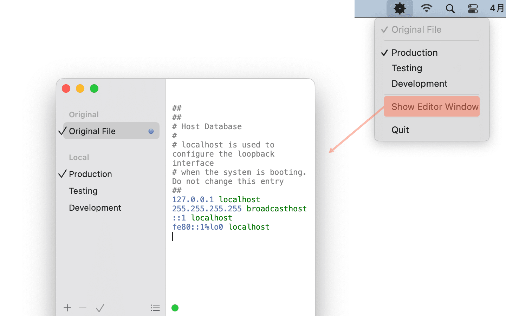

import ReactPlayer from 'react-player';

# Helm

Helm是一个运行在mac OS系统的`hosts`文件管理器，Helm使你能够编辑`hosts`文件并在它们之间切换，每次切换的时候Helm会将公共文件（Original File）和激活的文件合并为一个文件写入到mac系统的`hosts`文件。

可以在偏好（`⌘,`）中设置是否透明标题栏，可以在偏好中设置是否保持菜单栏运行(Keep running in menu bar when closing editor window)。假设你选择保持菜单栏运行，关闭编辑窗口后Helm并不会退出程序，而是以Menu Bar的形式运行，你可以通过Menu Bar快速切换不同环境的文件。

## 安装

* <a href="https://storage.googleapis.com/arayofsunshine/Helm.2.3.0.zip">下载</a>

## 帮助

### 授权

启动后即可添加不同的环境文件，第一次保存的时候软件会弹出对话框，点击**授权（Authorize）**，软件就可以获取`hosts`读写权限。

接着再保存会第二次弹出对话框，此时需要对当前mac用户添加写入权限，按照提示复制命令行到终端（bash、iTerm）敲回车键运行，输入密码即可完成授权。

此时2步授权操作已经完成，可以自由编辑组合hosts文件，从此以后不需要再授权。

### 修改hosts后Chrome没生效

在Helm执行保存操作，Helm会自动清除dns缓存。此时如果hosts没生效，有下面几种方式可以解决：

* `command+shift+N`：使用无痕模式。
* 在chrome打开`chrome://net-internals/#sockets`，点击`Flush socket pools`。

### 技巧

* `Command＋shift + O`：打开系统hosts文件
* `Command + D`：复制当前行或当前选区
* `Command + /`：在注释与取消注释当前行之间切换
* `Command + +` : 放大文字
* `Command + 0` : 恢复默认文字大小
* `Command + -` : 缩小文字
