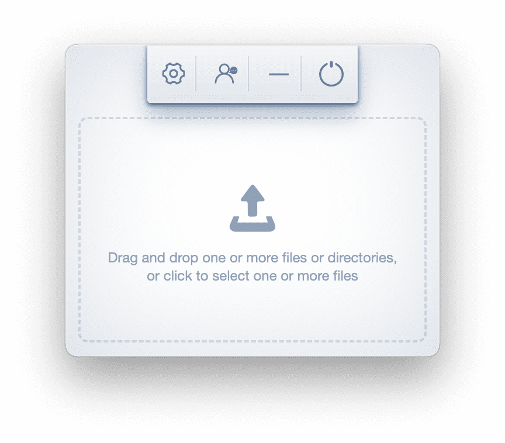

`Hummingbird`是一个资源(jpg/png/webp/svg/gif/css/js/html)压缩客户端。

* jpg/png/webp/svg/gif/html压缩后会替换掉当前文件，css/js压缩后会生成一个带.min的新文件
* 可以在在当前目录新建`source`文件夹并备份处理前的文件，可以在设置中开启

## 安装

* <a href="https://pan.baidu.com/s/1dFAaosL">macOS v2.0.0</a> (推荐使用，不支持拖放文件夹压缩)
* ~~macOS v4.0.1~~
* <a href="https://pan.baidu.com/s/1146zRGqLFlDR27a7rUgr5w">Windows v3.0.0</a> (推荐使用，支持拖放文件夹压缩)

`OS X` 可能需要你在`系统偏好设置` → `安全性与隐私` 选择允许`任何来源`的应用程序

`Windows`是一个解压文件夹而不是安装包。

* (建议)将下载后的压缩包解压到目标文件夹，选择`Hummingbird.exe`右键单击 → 选择`发送到` → `桌面快捷方式`
* (或)直接运行解压目录下`Hummingbird.exe`
* 在Windows系统中.JPG后缀的文件可能会无法运行

> 分享统计数据和压缩参数配置数据是保存在用户目录下`hummingbird-config.json`中，本App不做任何数据上传，绝对安全。

[github](https://github.com/leibnizli/hummingbird)
